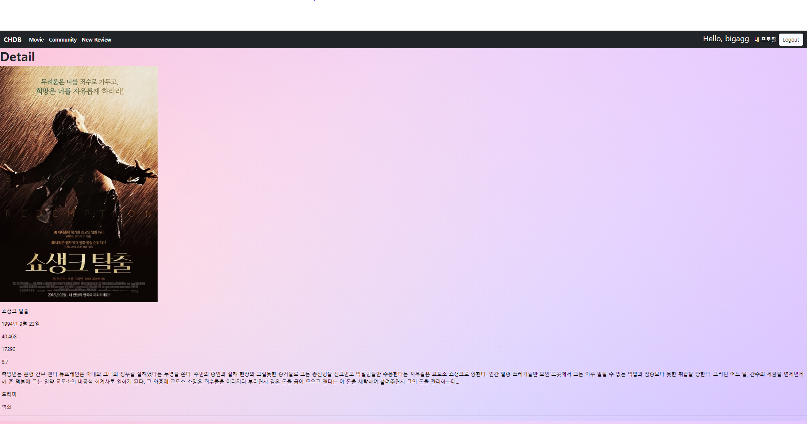

# 알고리즘을 적용한 서버 구성


### 요구사항

A. 유저 팔로우 기능 

B. 리뷰 좋아요 기능 

C. Movies 앱 기능 

    1. 전체 영화 목록 조회 
        1. 단일 영화 상세 조회 
        1. 영화 추천 기능


### 프로젝트 구상안


## A.유저 팔로우 기능


### view.py

```python
@require_POST
def follow(request, user_pk):
    if request.user.is_authenticated:
        User = get_user_model()
        me = request.user
        you = User.objects.get(pk=user_pk)
        if me != you:
            if you.followers.filter(pk=me.pk).exists():
                you.followers.remove(me)
                is_followed = False
            else:
                you.followers.add(me)
                is_followed = True
            context = {
                'is_followed': is_followed,
                'followers_count': you.followers.count(),
                'followings_count': you.followings.count(),
            }
            return JsonResponse(context)
        return redirect('accounts:profile', you.username)
    return redirect('accounts:login')
```


### templates/account/profile.html

```django



  <h1>{{ person.username }}의 프로필 페이지</h1>
  
    <div>
      <div>
        팔로워 : <span id="followers-count">{{ person.followers.all|length }}</span> 
        팔로잉 : <span id="followings-count">{{ person.followings.all|length }}</span>
      </div>
      
        <div>
          <form id="follow-form" data-user-id="{{ person.pk }}">
            
            
              <button id="followBtn">언팔로우</button>
            
              <button id="followBtn">팔로우</button>
            
          </form>
        </div>
      
    </div>
  



  <script src="https://cdn.jsdelivr.net/npm/axios/dist/axios.min.js"></script>
  <script>

  const form = document.querySelector('#follow-form')
  const csrftoken = document.querySelector('[name=csrfmiddlewaretoken]').value
  form.addEventListener('submit', function (event) {
    event.preventDefault()
    const userId = event.target.dataset.userId
    axios({
      method: 'post',
      url: `/accounts/${userId}/follow/`,
      headers: {'X-CSRFToken': csrftoken,}
    })
      .then((response) => {
        const isFollowed = response.data.is_followed
        const followBtn = document.querySelector('#followBtn')
        const followersCountTag = document.querySelector('#followers-count')
        const followingsCountTag = document.querySelector('#followings-count')
        if (isFollowed === true) {
          followBtn.innerText = '언팔로우'
        } else {
          followBtn.innerText = '팔로우'
        }
        const followersCount = response.data.followers_count
        const followingsCount = response.data.followings_count
        followersCountTag.innerText = followersCount
        followingsCountTag.innerText = followingsCount
      })
  })
  </script>

```

### 학습한 내용

- AJAX 통신을 이용하여 서버에서 데이터를 받아와 상황에 맞게 HTML 화면을 구성하는 법

### 어려웠던 부분 

- AJAX 통신 그 자체를 이해하는 과정이 어려웠다.
- AJAX 비동기 처리를 하며, 팔로워 팔로우 인원 수 뿐만이 아닌 유저들 정보도 얻어오고 싶었는데,
  쿼리셋을 json으로 전달할 수 없다는 오류를 해결하지 못하였다.
- AJAX랑 view랑 template 데이터를 주고 받는 방법이 어려웠다.

### 느낀 점

- 공부를 전체적으로 한 번 훑듯이 해야되겠다.
- Ajax통신을 공부해야겠다.


## B. 리뷰 좋아요 기능


### view.py

```python
@require_POST
def like(request, review_pk):
    if request.user.is_authenticated:
        review = Review.objects.get(pk=review_pk)#get_object_or_404(Review, pk=review_pk)
        user = request.user

        if review.like_users.filter(pk=user.pk).exists():
            review.like_users.remove(user)
            is_liked = False
        else:
            review.like_users.add(user)
            is_liked = True
        context = {
            'is_liked': is_liked,
            'likes_count': review.like_users.count(),
        }
        return JsonResponse(context)
        #return redirect('community:index')
    return redirect('accounts:login')
```


### templates/community/index.html

```django



  <h1 class="fw-bold">Community</h1>
  <hr>
  
    <p>작성자 : <a href="">{{ review.user }}</a></p>
    <p>글 번호: {{ review.pk }}</p>
    <p>글 제목: {{ review.title }}</p>
    <p>글 내용: {{ review.content }}</p>
    <form class="like-forms" data-review-id="{{ review.pk }}">
      
      
        <input  type="submit"  id="like-{{ review.pk }}" value="좋아요 취소"/>
      
        <input  type="submit"  id="like-{{ review.pk }}" value="좋아요"/>
      
    </form>
    <p>
      <span id="likes-{{ review.pk }}">{{ review.like_users.all|length }}</span> 명이 이 글을 좋아합니다.
    </p>
    <a href="">[detail]</a>
    <hr>
  



<script src="https://cdn.jsdelivr.net/npm/axios/dist/axios.min.js"></script>
<script>
  const forms = document.querySelectorAll('.like-forms')
  const csrftoken = document.querySelector('[name=csrfmiddlewaretoken]').value
  forms.forEach((form) => {
    form.addEventListener('submit', function (event){
      event.preventDefault()
      const reviewId = event.target.dataset.reviewId

      axios({
        method:"post",
        url:`/community/${reviewId}/like/`,
        headers: {'X-CSRFToken': csrftoken,}
      })
        .then((response)=>{
          const isLiked = response.data.is_liked
          const likeBtn = document.querySelector(`#like-${reviewId}`)
          if (isLiked === true) {
            likeBtn.value = '좋아요 취소'
          } else {
            likeBtn.value = '좋아요'
          }
          const likesCountTag = document.querySelector(`#likes-${reviewId}`)
          const likesCount = response.data.likes_count
          likesCountTag.innerText = likesCount
        })
    })
  })
</script>

```

### 학습한 내용

- AJAX 통신을 이용하여 서버에서 데이터를 받아와 상황에 맞게 HTML 화면을 구성하는 법

### 어려웠던 부분 

- AJAX 통신 그 자체를 이해하는 과정이 어려웠다.
- AJAX랑 view랑 template 데이터를 주고 받는 방법이 어려웠다.
- 여러개 버튼을 동시에 넣는 것이 어려웠다.

### 느낀 점

- 공부를 전체적으로 한 번 훑듯이 해야되겠다.
- Ajax통신을 공부해야겠다.


PJT 08

이번 pjt 를 통해 배운 내용

- 페어 프로그래밍을 통해 진행 방향을 같이 설정하고 협업 할수 있었다.


C. Movies 앱 기능

### 1. 전체 영화 목록 조회

요구 사항 : 사용자의 인증 여부와 관계없이 전체 영화 목록 조회 페이지에서 적절한 UI를 활용하여 영화 목록을 제공합니다.

결과 :


문제 접근 방법 및 코드 설명 :

movies/views.py

```python
from django.shortcuts import render, redirect
from django.views.decorators.http import require_safe
from django.contrib.auth.decorators import login_required
from django.views.decorators.http import require_http_methods, require_POST, require_safe
from .models import Genre, Movie
from .forms import GenreForm, MovieForm
from random import *

# Create your views here.
@require_safe
def index(request):
    movies = Movie.objects.all()
    context = {
        'movies': movies,
    }
    return render(request, 'movies/index.html', context)
```


movies/templates/index.html

```html



  <h1 class="fw-bold text-dark">Movies</h1>
  <article class="parent" style="width:1800px">
    
    <div class="row">

    
    <div class="col-1">
    <a class="font-default d-block w-100 child" href="">
      
    </a>
    </div>
    
    
  
     <div>{{ movie.title }}</div>
    <div>{{ movie.vote_average }}</div>
    <hr> 
    
  </article>


```

이 문제에서 어려웠던점: 크게 어려웠던 점은 없었던거 같다.

내가 생각하는 이 문제의 포인트: 전체 조회 기능을 설정하고 반복문을 통해 출력해주는 게 포인트 같다


### 2. 단일 영화 상세 조회

요구 사항 : 사용자의 인증 여부와 관계없이 단일 영화 상세 조회 페이지에서 적절한 UI를 활용하여 영화 정보를 제공합니다.

결과 : 

문제 접근 방법 및 코드 설명 :

movies/views.py

```python
from django.shortcuts import render, redirect
from django.views.decorators.http import require_safe
from django.contrib.auth.decorators import login_required
from django.views.decorators.http import require_http_methods, require_POST, require_safe
from .models import Genre, Movie
from .forms import GenreForm, MovieForm
from random import *

@require_safe
def detail(request, movie_pk):
    movie = Movie.objects.get(pk=movie_pk)
    context = {
        'movie': movie,
    }
    return render(request, 'movies/detail.html', context)
```


movies/templates/detail.html

```html



<article style="color: black;">
    <h1 class="fw-bold text-dark">Detail</h1>
    
    <p>
    <div style= "padding-left: 5px">
    <p>{{ movie.title }}</p>
    <p>{{ movie.release_date }}</p>
    <p>{{ movie.popularity }}</p>
    <p>{{ movie.vote_count }}</p>
    <p>{{ movie.vote_average }}</p>
    <p>{{ movie.overview }}</p>
    


    <p>{{ genre.name }}</p>

    </div>
</article>
<hr>

```

이 문제에서 어려웠던점:  위의 전체 조회 처럼 어렵지는 않았다.

내가 생각하는 이 문제의 포인트:  pk를 통해 단일 영화를 조회하는 기능을 짜는게 중요했고 Recommend에서 영화 포스터를 누르면 그 영화의 디테일 페이지로 연결되도록 설정도 하였다!


### 3. 영화 추천 기능

요구 사항 : 사용자가 인증되어 있다면, 적절한 알고리즘을 활용하여 10개의 영화를 추천하여 제공합니다.

영화를 추천하는 알고리즘은 자유롭게 구상합니다.

결과 : 

문제 접근 방법 및 코드 설명 :

movies/views.py

```python
@require_safe
def recommended(request):
    movies = Movie.objects.all()
    movies2 = Movie.objects.filter(vote_count__gte=6000, vote_average__gte=8)
    many = movies2.count()
    num = randrange(0, many-1)
    goodmovie = movies2[num]

    context = {
        'movies': movies,
        'movies2': movies2[:40],
        'goodmovie':goodmovie,
    }
    return render(request, 'movies/recommended.html', context)
```


movies/templates/recommended.html

```html



<article>
<h1 class="fw-bold">Recommendation</h1>
<br>
<div style="width:100%; padding-left: 5px;">
    <a  href="">
    
    </a>
</div>
<br>
<br>

<div class="row">

<div class="col-1">
    <a class="font-default d-block w-100 child" href="">
    
    </a>
    <br>
    <br>
</div>

</div>


</article>


```

이 문제에서 어려웠던점: 영화에 대한 데이터를 가지고 추천하는 영화를 추천하는 기능을 만드는 것이라 처음에 어떻게 해야할지 몰랐었는데, 구글링하며 좋은 예시들은 몇개 찾아서 참고 하였다.

내가 생각하는 이 문제의 포인트: 간단한 추천 기능으로 영화 데이터의 vote_count와 vote_average를 이용하여 

vote_count가 6000이상,  vote_average가 8이상인 괜찮은 영화들로 추천하였다.

```python
movies2 = Movie.objects.filter(vote_count__gte=6000, vote_average__gte=8)
num = randrange(0, many-1)
goodmovie = movies2[num]
```


### 후기

처음 페어 프로그래밍을 한 경험이라 깃을 이용한 협업을 처음 하는데 약간 어려웠지만, 요령이 생겨 성공적으로 프로젝트를 하여 행복한 결과를 얻었다.

나에게 주어진 task를 해내서 페어에게 보여줄때마다 작은 뿌듯함이 느껴졌다.