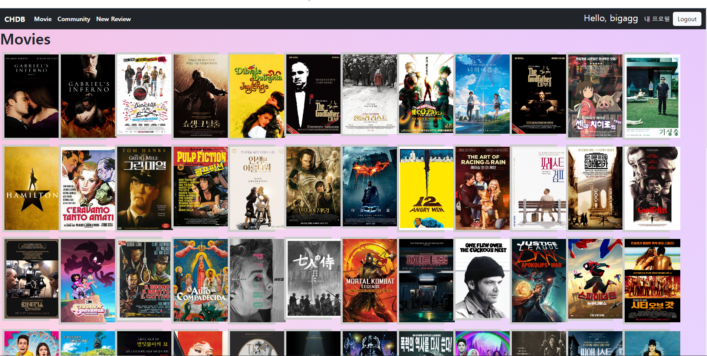

PJT 08

이번 pjt 를 통해 배운 내용

- 페어 프로그래밍을 통해 진행 방향을 같이 설정하고 협업 할수 있었다.


C. Movies 앱 기능

### 1. 전체 영화 목록 조회

요구 사항 : 사용자의 인증 여부와 관계없이 전체 영화 목록 조회 페이지에서 적절한 UI를 활용하여 영화 목록을 제공합니다.

결과 :




문제 접근 방법 및 코드 설명 :

movies/views.py

```python
from django.shortcuts import render, redirect
from django.views.decorators.http import require_safe
from django.contrib.auth.decorators import login_required
from django.views.decorators.http import require_http_methods, require_POST, require_safe
from .models import Genre, Movie
from .forms import GenreForm, MovieForm
from random import *

# Create your views here.
@require_safe
def index(request):
    movies = Movie.objects.all()
    context = {
        'movies': movies,
    }
    return render(request, 'movies/index.html', context)
```


movies/templates/index.html

```html



  <h1 class="fw-bold text-dark">Movies</h1>
  <article class="parent" style="width:1800px">
    
    <div class="row">

    
    <div class="col-1">
    <a class="font-default d-block w-100 child" href="">
      
    </a>
    </div>
    
    
  
     <div>{{ movie.title }}</div>
    <div>{{ movie.vote_average }}</div>
    <hr> 
    
  </article>


```

이 문제에서 어려웠던점: 크게 어려웠던 점은 없었던거 같다.

내가 생각하는 이 문제의 포인트: 전체 조회 기능을 설정하고 반복문을 통해 출력해주는 게 포인트 같다


### 2. 단일 영화 상세 조회

요구 사항 : 사용자의 인증 여부와 관계없이 단일 영화 상세 조회 페이지에서 적절한 UI를 활용하여 영화 정보를 제공합니다.

결과 : 

문제 접근 방법 및 코드 설명 :

movies/views.py

```python
from django.shortcuts import render, redirect
from django.views.decorators.http import require_safe
from django.contrib.auth.decorators import login_required
from django.views.decorators.http import require_http_methods, require_POST, require_safe
from .models import Genre, Movie
from .forms import GenreForm, MovieForm
from random import *

@require_safe
def detail(request, movie_pk):
    movie = Movie.objects.get(pk=movie_pk)
    context = {
        'movie': movie,
    }
    return render(request, 'movies/detail.html', context)
```


movies/templates/detail.html

```html



<article style="color: black;">
    <h1 class="fw-bold text-dark">Detail</h1>
    
    <p>
    <div style= "padding-left: 5px">
    <p>{{ movie.title }}</p>
    <p>{{ movie.release_date }}</p>
    <p>{{ movie.popularity }}</p>
    <p>{{ movie.vote_count }}</p>
    <p>{{ movie.vote_average }}</p>
    <p>{{ movie.overview }}</p>
    


    <p>{{ genre.name }}</p>

    </div>
</article>
<hr>

```

이 문제에서 어려웠던점:  위의 전체 조회 처럼 어렵지는 않았다.

내가 생각하는 이 문제의 포인트:  pk를 통해 단일 영화를 조회하는 기능을 짜는게 중요했고 Recommend에서 영화 포스터를 누르면 그 영화의 디테일 페이지로 연결되도록 설정도 하였다!


### 3. 영화 추천 기능

요구 사항 : 사용자가 인증되어 있다면, 적절한 알고리즘을 활용하여 10개의 영화를 추천하여 제공합니다.

영화를 추천하는 알고리즘은 자유롭게 구상합니다.

결과 : 

문제 접근 방법 및 코드 설명 :

movies/views.py

```python
@require_safe
def recommended(request):
    movies = Movie.objects.all()
    movies2 = Movie.objects.filter(vote_count__gte=6000, vote_average__gte=8)
    many = movies2.count()
    num = randrange(0, many-1)
    goodmovie = movies2[num]

    context = {
        'movies': movies,
        'movies2': movies2[:40],
        'goodmovie':goodmovie,
    }
    return render(request, 'movies/recommended.html', context)
```


movies/templates/recommended.html

```html



<article>
<h1 class="fw-bold">Recommendation</h1>
<br>
<div style="width:100%; padding-left: 5px;">
    <a  href="">
    
    </a>
</div>
<br>
<br>

<div class="row">

<div class="col-1">
    <a class="font-default d-block w-100 child" href="">
    
    </a>
    <br>
    <br>
</div>

</div>


</article>


```

이 문제에서 어려웠던점: 영화에 대한 데이터를 가지고 추천하는 영화를 추천하는 기능을 만드는 것이라 처음에 어떻게 해야할지 몰랐었는데, 구글링하며 좋은 예시들은 몇개 찾아서 참고 하였다.

내가 생각하는 이 문제의 포인트: 간단한 추천 기능으로 영화 데이터의 vote_count와 vote_average를 이용하여 

vote_count가 6000이상,  vote_average가 8이상인 괜찮은 영화들로 추천하였다.

```python
movies2 = Movie.objects.filter(vote_count__gte=6000, vote_average__gte=8)
num = randrange(0, many-1)
goodmovie = movies2[num]
```


### 후기

처음 페어 프로그래밍을 한 경험이라 깃을 이용한 협업을 처음 하는데 약간 어려웠지만, 요령이 생겨 성공적으로 프로젝트를 하여 행복한 결과를 얻었다.

나에게 주어진 task를 해내서 페어에게 보여줄때마다 작은 뿌듯함이 느껴졌다.